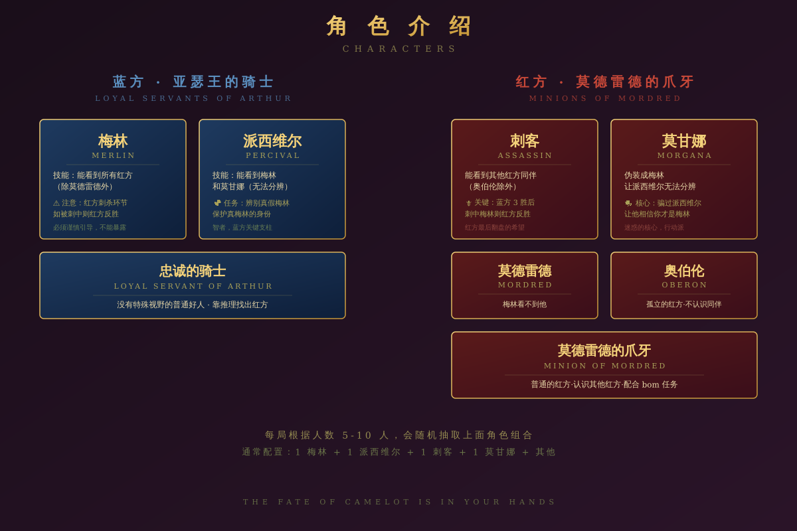
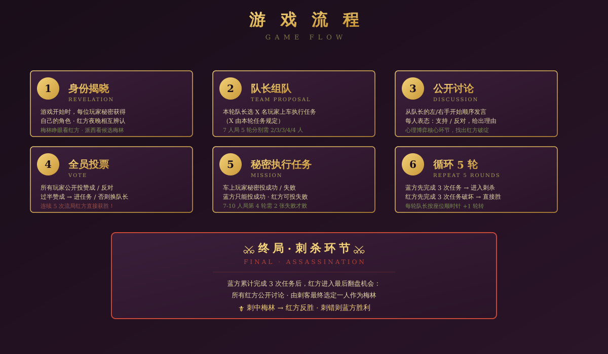

<div align="center">


# 🏰 阿瓦隆 · Avalon

### 王座之下，忠诚与背叛同席而坐

**一个人也能玩的阿瓦隆 · AI 玩家会演戏 · 单文件 HTML 即开即玩**

[](https://react.dev) [](https://platform.deepseek.com) [](https://platform.moonshot.cn) [](https://qianfan.baidubce.com) [](LICENSE)

[🇨🇳 中文](#-中文文档) · [🇬🇧 English](#-english)

</div>

---

## 📜 来自亚瑟王传说的故事

> *剑栏血战之夜——长矛与利刃在血色月光下相会。*
>
> *亚瑟王的长矛刺穿了**莫德雷德**的盾牌，而那叛子卯足全力，双手握剑削去了王者半个头盔。世界本应于此沉寂。*
>
> *可**梅林**与**派西维尔**不愿放弃。他们扶起奄奄一息的王者，登上一叶小舟，驶向迷雾深处的圣岛——**阿瓦隆**。*
>
> *岛上由精灵守护，没有时间，没有岁月。只要圣杯之水能送到王者唇边，亚瑟便能起死回生。*
>
> ***但这艘船上，并非所有人都希望王者复活。***
>
> *莫甘娜——王者同母异父的姐姐，眉宇间藏着千年的恨。*
> *莫德雷德——王者的私生子，剑栏之上几乎砍下王者头颅的复仇者。*
> *奥伯伦——精灵王，受湖中女仙之命混入凡人血肉。*
>
> *他们与暗影骑士团混入了护卫队。要在小舟靠岸之前——**刺死那位知晓圣杯秘密的人——梅林**。*
>
> *—— 故事在这里展开。*

---

## 🇨🇳 中文文档

### 💡 一句话介绍

> 一个人也能玩 5-10 人桌游！打开网页就开局，AI 玩家会装好人、装糊涂、互相 cue、合伙演戏。

### 🎬 这是什么

**阿瓦隆**（The Resistance: Avalon）是一款基于亚瑟王传说的**身份推理桌游**——你将扮演一位骑士，与同伴们护送奄奄一息的亚瑟王前往圣岛。但船上有人是叛徒。蓝方靠完成 3 次任务获胜，红方靠破坏任务**或最后刺杀梅林**翻盘。

凑齐 5-10 个人才能玩？这里**一个人**就能开局。

### 🃏 谁在船上

#### 🔵 蓝方 · 亚瑟王的忠臣

<table>
<tr>
<td width="33%" valign="top">

**🪄 梅林**

*传说中的伟大魔法师，亚瑟王的挚友与导师。曾预言"莫德雷德将毁灭大不列颠"。*

知晓所有红方（除莫德雷德）。但若被刺客认出，王者将永远沉睡。

</td>
<td width="33%" valign="top">

**🛡 派西维尔**

*亚瑟王最信任的圆桌骑士。圣杯之行由他护卫。*

视野中有 2 个候选梅林（一真一假），需用观察辨认。可装作梅林吸引刺客火力。

</td>
<td width="33%" valign="top">

**⚔️ 忠臣**

*亚瑟王的圆桌骑士。剑曾在卡米洛特发过誓。*

无视野，靠骑士的直觉、伙伴的脸色、任务的胜败找出叛徒。

</td>
</tr>
</table>

#### 🔴 红方 · 暗影中的背叛者

<table>
<tr>
<td width="33%" valign="top">

**🗡 刺客**

*莫德雷德派系最锋利的剑。*

整局像普通骑士般谈笑，眼睛却从未离开过梅林。蓝方完成 3 次任务时，他将拔出匕首——一击得手，王国陷落。

</td>
<td width="33%" valign="top">

**🌒 莫甘娜**

*亚瑟王同母异父的姐姐。曾以迷药与王共度禁忌之夜，孕下莫德雷德。*

伪装成梅林，让派西维尔陷入混乱。说话像有视野——但故意指错好人。

</td>
<td width="33%" valign="top">

**👑 莫德雷德**

*亚瑟王与莫甘娜之子，被父亲下令放逐的婴孩。剑栏之上几乎砍下王者头颅。*

最大优势：梅林看不见他。可堂堂正正坐在桌前，假装最忠诚的骑士。

</td>
</tr>
<tr>
<td width="33%" valign="top">

**🌫 奥伯伦**

*精灵王。受湖中女仙薇薇安委托混入护卫队。不是人类，扭曲的灵魂只为阻止亚瑟复活。*

不认识任何同伴，同伴也认不出他。一场孤独的破坏。

</td>
<td width="33%" valign="top">

**🐍 莫德雷德的爪牙**

*暗影骑士团成员。曾是圆桌骑士之一，剑栏战场上选择了背叛。*

认识所有红方同伴（除奥伯伦）。装作忠诚，让圣杯之水永远到不了王者唇边。

</td>
<td width="33%" valign="top">

</td>
</tr>
</table>



### 😎 这版本不一样在哪

不是普通"AI 当陪练"——这里的 AI 玩家**会真演戏**：

<table>
<tr>
<td width="50%">

#### 🎭 角色扮演到位

- **梅林会装糊涂**——绝不精准指认（怕被刺客盯上），用"我感觉""说不清"模糊词
- **莫甘娜装梅林**——故意指好人陷害，让派西维尔分不清真假
- **莫德雷德主动出击**——梅林看不见他，他大胆装好人推理
- **奥伯伦发暗号**——孤独红方靠"勉强反对干净人"试探搭子
- **刺客整局观察**——每轮记录谁像梅林，最后给你致命一刀

</td>
<td width="50%">

#### 🧠 AI 真在思考

- **会算双队对比**——"3 号在第 1 轮 + B 失败，第 2 轮 + C 成功 → B 红 C 蓝"
- **会记投票模式**——某号反对率高 = 梅林嫌疑大
- **会改主意会解释**——"我上轮反对，听了 5 号的觉得有道理才改"
- **会避嫌**——红方 bom 完下一轮发言会克制
- **会反思**——"全场都支持的车居然失败了……我们被骗了"

</td>
</tr>
</table>

### 🎮 三种玩法

```
🧑 自己玩       → 你亲自发言、投票、做任务         ← 推荐
💡 建议模式     → AI 给你"思路+话术"，你自己决定    ← 适合新手
🤖 AI 代理      → AI 完全替你玩，你纯观战          ← 看 AI 互相博弈
```

### 🎯 AI 玩家发言长这样

> 这是一段真实游戏录像（节选）：

```
1号(队长开场)：信息少，先随便带几个看看。3、5、7号上车。
              我自己也在车上担保。

3号：嗯…我跟一把，但 7号上轮没动静我有点犹豫。

5号：我先反对。不是不信 1号你，是 7号那波太安静了，
     不能就这么放过去。

7号：哎，5号别盯我，我就是没想好。让我想想啊…
     1号你这队里其实 3号最稳，但 5号你反对的逻辑我没看懂。

(投票后任务失败)

3号：卧槽这都失败了？我跟错车了！

5号：我说什么来着，7号果然有问题。
```

### 🚀 一分钟开始

#### 方法 1：直接玩（最简单）
```
下载 avalon.html → 双击打开 → 立刻能玩
（无 AI 模式用本地预设台词，体验有限但能跑流程）
```

#### 方法 2：接入 AI（强烈推荐，体验完全不同）
```
1. 打开网页
2. 点右上角 ⚙ AI 设置
3. 选择 provider（百度千帆免费 / DeepSeek / Kimi）
4. 复制 API Key 填入
5. 点"测试 Key"→ 绿色 ✓ → 开始游戏
```

### 💰 接入 AI 多少钱

| AI 服务商 | 价格 | 速度 | 推荐场景 |
|----|----|----|----|
| 🆓 **百度千帆** | **新用户免费额度**（实名后） | 快 | **首次试玩推荐** |
| 💰 **DeepSeek V4** | ¥10 起，按用量计费 | 中 | 推理质量最好 |
| 💰 **Kimi** | ¥1 起 | 中 | 中文表达流畅 |

> 💡 一局游戏大约消耗 ¥0.1-0.3，¥10 能玩几十局

### 🎲 一轮怎么玩



```
1. 队长选 N 人组队（N 由本轮决定）
   ↓
2. 队长选发言方向（左手起 / 右手起）
   ↓
3. 队长开场——解释为什么这么组队
   ↓
4. 玩家依序发言——表态支持/反对，分析推理
   ↓
5. 队长总结——决定维持原队 or 重新组队（每轮最多重组一次）
   ↓
6. 全员投票——过半赞成 → 进任务；否则换下一位队长
   ↓
7. 任务执行——队员暗投成功/失败
   1 张失败票 = 任务失败
   (7-10 人局第 4 轮例外：需 2 张失败票)
   ↓
↻ 循环 5 轮
   蓝方先完成 3 次任务 → 进入刺杀环节
   红方先让 3 次任务失败 → 直接胜利
   连续 5 次流局（队伍被否决）→ 红方直接胜利
```

#### 🗡 刺杀环节（蓝方达成 3 胜时触发）

```
1. 公开揭晓所有红方身份
2. 红方按随机起点 + 顺时针顺序公开讨论梅林是谁（最多 2 轮）
3. 刺客最终决定刺杀目标
   ↓
   ✓ 刺中梅林 → 红方反败为胜
   ✗ 刺错 → 蓝方真正胜利
```

### 💡 新手避坑指南

<table>
<tr><th>角色</th><th>常见死法</th><th>怎么避免</th></tr>
<tr>
<td>🔵 梅林</td>
<td>第 1 轮就精准指认红方 → 刺客锁定你</td>
<td>第 1 轮装得和普通好人一样模糊</td>
</tr>
<tr>
<td>🔵 派西</td>
<td>公开说"X 号是真梅林" → 刺客谢谢你</td>
<td>永远保持"两个我都不太确定"</td>
</tr>
<tr>
<td>🔴 莫甘娜</td>
<td>第 1 轮就装梅林 → 直接暴露</td>
<td>第 1 轮也老实当好人，第 2 轮以后才发力</td>
</tr>
<tr>
<td>🔴 红方搭子</td>
<td>每次都互相支持 → 全场识破</td>
<td>偶尔反对自己搭子（用好人逻辑）</td>
</tr>
<tr>
<td>🔴 奥伯伦</td>
<td>2 人车 1 失败时不知道指认谁</td>
<td>和好人一样硬指对方（"我投的成功"）</td>
</tr>
</table>

### 🛠 技术栈

- **前端**：单文件 React 18 + Tailwind CSS（无构建步骤！）
- **AI**：DeepSeek V4 / Kimi / 百度千帆（OpenAI 兼容 API）
- **存储**：浏览器 localStorage（不上传服务器）
- **部署**：纯静态 HTML，可部署到任何静态服务器

### 📂 项目结构

```
avalon/
├── avalon.html          # 整个游戏（一个文件，约 7000 行）
├── index.html           # 同上的副本（GitHub Pages 入口）
├── README.md            # 这个文件
├── readme-assets/
│   ├── banner.png       # 顶部横幅
│   ├── roles.png        # 角色介绍图
│   └── flow.png         # 流程图
└── 阿瓦隆-1分钟入门.pdf   # 速查手册（A4 单页）
```

### 🚀 部署到 GitHub Pages

```bash
# 1. fork / 创建一个新 repo
# 2. 把 avalon.html、index.html、README.md、readme-assets/ 都丢进去
# 3. Settings → Pages → Source 选 main 分支 / root → Save
# 4. 等 1-2 分钟，访问 https://你的用户名.github.io/repo名/
```

### 🤔 常见问题

<details>
<summary><b>API Key 测试失败显示 "Failed to fetch" 怎么办？</b></summary>

通常是网络问题：
- 切换到**百度千帆**（国内最稳）
- 关闭浏览器扩展（广告拦截器、隐私插件可能拦截请求）
- 切换网络（手机热点 / VPN 节点）

</details>

<details>
<summary><b>不接入 AI 也能玩吗？</b></summary>

可以！游戏内置本地预设台词，不接入 AI 也能跑完整流程。但 AI 玩家的发言会**比较模板化**，没有真实推理。建议至少试一次接入 AI 的体验，差别很大。

</details>

<details>
<summary><b>API Key 安全吗？</b></summary>

完全安全：
- Key 只保存在**你自己浏览器**的 localStorage 里
- 没有任何后端服务器收集
- 没有埋点、没有 analytics

</details>

<details>
<summary><b>能跨设备玩吗（手机/电脑同步）？</b></summary>

不能。游戏存档存在浏览器 localStorage 里，换设备就要重开。如果想保留某局战绩，可以截图保存。

</details>

<details>
<summary><b>为什么发了句脏话游戏就直接结束了？</b></summary>

游戏里设置了**文明发言机制**——检测到攻击性词汇会立刻终止本局并删除战绩。
这个游戏想营造的是**圆桌骑士的氛围**——彼此可以质疑、可以背叛、可以互相试探，但不应有侮辱和攻击。
请保持骑士般的风度。

</details>

<details>
<summary><b>怎么修改游戏规则 / AI 策略？</b></summary>

所有逻辑都在 `avalon.html` 一个文件里：
- 角色配置：搜 `ROLE_DEFS` / `ROLE_COMPOSITIONS`
- AI 策略 prompt：搜 `strategy` 关键字
- 发言铁律：搜 "铁律 A"

直接改完保存，浏览器刷新即可生效（无需构建）。

</details>

### 📝 反馈 / 贡献

发现 bug 或想加功能？欢迎：
- 提 [Issue](../../issues) 报 bug 或建议
- 提 [Pull Request](../../pulls) 直接贡献代码

### 📜 License

MIT — 自由使用、修改、分发

### ❤️ 致谢

灵感来自 Don Eskridge 的经典桌游 [The Resistance: Avalon](https://en.wikipedia.org/wiki/The_Resistance_(game))。

故事内容引自亚瑟王传说与凯尔特神话。

---

## 🇬🇧 English

### 📜 The Tale

> *On the night of the Battle of Camlann—Arthur's spear pierced Mordred's shield. The traitor, with his last strength, raised his sword and cleaved off half the King's helmet. The world should have ended there.*
>
> *But **Merlin** and **Percival** would not let it. They lifted the dying King onto a small boat and rowed into the mist toward the holy isle—**Avalon**.*
>
> *On this island guarded by faeries, time does not pass. The Holy Grail's water can revive the King.*
>
> ***But not everyone on this boat wishes the King to live.***
>
> *Morgana—the King's half-sister, harboring centuries of hatred.*
> *Mordred—the King's bastard son, who once nearly took his head at Camlann.*
> *Oberon—the Faerie King, sent by the Lady of the Lake.*
>
> *They mingle among the loyal knights. Their goal: kill the only one who knows the Grail's secret—**Merlin**—before the boat reaches shore.*
>
> *—— Here the story begins.*

### 💡 What is this

> Play 5-10 player Avalon by yourself. Open the web page, AI players will act like real humans — bluffing, deducing, calling each other out, even covering for partners.

### 🎬 What's special

Not your usual "AI chatbot" — these AI players **actually act**:

#### 🎭 Role-playing on point
- **Merlin plays dumb** — never points fingers precisely (assassin is watching), uses vague words
- **Morgana fakes Merlin** — deliberately accuses good guys to confuse Percival
- **Mordred goes offensive** — Merlin can't see him, so he boldly "deduces" as a good knight
- **Oberon sends signals** — lone evil player tries to find partners via subtle speech
- **Assassin keeps notebook** — quietly tracks who looks like Merlin every round

#### 🧠 AI actually thinks
- **Cross-team comparison** — "Player 3 was in failed Round 1 with B, success Round 2 with C → B is evil, C is good"
- **Vote pattern tracking** — high opposition rate = Merlin suspect
- **Mind-change explanations** — "I opposed last round, but #5's argument convinced me"
- **Post-failure reactions** — "Wow that failed", "Knew it was suspicious"

### 🎮 Three play modes

```
🧑 Self play     → You speak, vote, mission personally       ← Recommended
💡 Advice mode   → AI gives "thinking + speech", you decide  ← Beginner-friendly
🤖 AI agent      → AI plays for you, you just watch          ← See AI vs AI
```

### 🚀 Quick start

```bash
# Method 1: Just download (simplest)
Download avalon.html → Double-click → Play (no AI, uses local presets)

# Method 2: With AI (recommended)
Open page → ⚙ AI Settings → Pick provider → Enter API Key → Test
```

**3 AI providers** (only one active at a time):

| Provider | Price | Notes |
|----|----|----|
| 🆓 **Baidu Qianfan** | **Free quota** for new users | Most stable in China |
| 💰 **DeepSeek V4** | Pay-as-you-go, ¥10 minimum | Strong reasoning |
| 💰 **Kimi** | Pay-as-you-go, ¥1 minimum | Best Chinese expression |

### 🃏 Roles

#### Blue (Good) — Win by 3 successful missions
| Role | Vision | Goal | How to play |
|----|----|----|----|
| 🔵 Merlin | All evil (except Mordred) | Help Blue win without being identified | Play dumb! Use vague words |
| 🔵 Percival | 2 Merlin candidates | Protect real Merlin | Watch candidates; can fake Merlin |
| 🔵 Loyal Servant | None | Find evil players | Track mission results |

#### Red (Evil) — Win by 3 failed missions / Stab Merlin
| Role | Vision | Goal | How to play |
|----|----|----|----|
| 🔴 Assassin | All evil + assassinate at Blue's 3rd win | Fail missions / Stab Merlin | Pretend good, watch for Merlin |
| 🔴 Morgana | All evil | Make Percival think you're real Merlin | Fake vision, mis-accuse |
| 🔴 Mordred | All evil (Merlin can't see) | Use invisibility | Boldly "deduce" |
| 🔴 Oberon | None | Pretend good + find partners | Send subtle signals |
| 🔴 Minion | All evil | Coordinate with partners | Use good-guy logic |

### 🎲 One round

```
1. Leader picks N players (N depends on round)
2. Leader chooses speaking direction
3. Leader's opening speech
4. Players speak in order
5. Leader's summary (keep team or revise)
6. Vote (majority approves → mission; otherwise next leader)
7. Mission (secret success/fail)
   1 fail = mission fails (Round 4 of 7-10p needs 2 fails)
```

**Win conditions**:
- 🔵 Blue: 3 successes → BUT Assassin can name Merlin → if hits, Red wins
- 🔴 Red: 3 fails / Hits Merlin / 5 consecutive rejections

### 🛠 Tech stack

- **Frontend**: Single-file React 18 + Tailwind CSS (no build step!)
- **AI**: DeepSeek V4 / Kimi / Baidu Qianfan (OpenAI-compatible API)
- **Storage**: Browser localStorage (no server upload)
- **Deploy**: Pure static HTML, deploy anywhere

### 🚀 Deploy to GitHub Pages

```bash
# 1. Fork / create new repo
# 2. Drop avalon.html, index.html, README.md, readme-assets/ into it
# 3. Settings → Pages → Source: main / root → Save
# 4. Wait 1-2 min, visit https://yourname.github.io/reponame/
```

### 📝 Contributing

PRs welcome! Improve AI strategies, add UI, fix bugs.

The codebase is mostly:
- `avalon.html` — entire game (one file, ~7000 lines, React + inline CSS)

To develop:
```bash
# Just open avalon.html in browser - no build needed!
```

### 📜 License

MIT

### ❤️ Credits

Inspired by Don Eskridge's classic [The Resistance: Avalon](https://en.wikipedia.org/wiki/The_Resistance_(game)) board game.

Story content draws from Arthurian legend and Celtic mythology.

---

<div align="center">

**🏰 May the realm of Logres be yours, brave knight. 🏰**

*愿罗格里斯王国永属于你，勇敢的骑士。*

</div>
